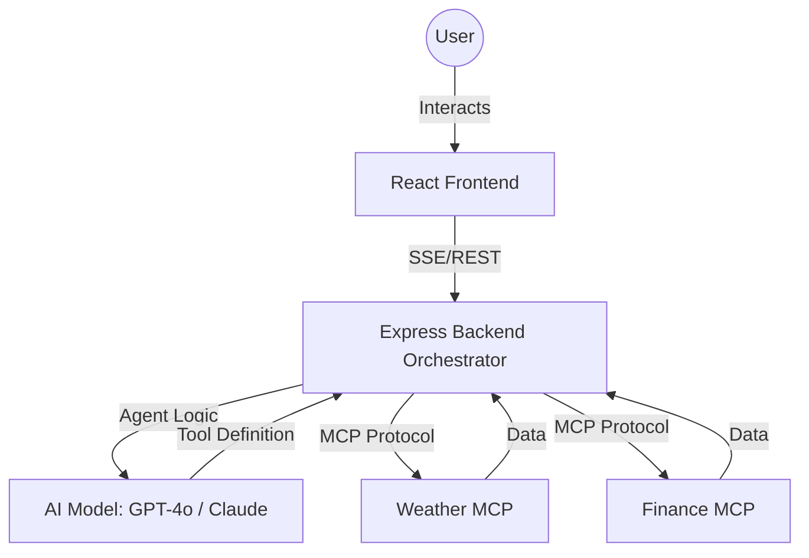

# System Architecture

This document describes the technical design and data flow of the AI-Powered Dynamic Dashboard.

## 🏗️ High-Level Component Diagram

## 🧠 Core Workflows

### 1. Dynamic Discovery & Rendering
1. **Tool Discovery**: When an MCP server is added, the Backend queries the server for its available tools using the MCP `listTools` capability.
2. **AI Reasoning**: The AI Agent is initialized with the list of discovered tools and a set of **UI Rendering Tools** (e.g., `render_metric`, `render_chart`).
3. **Execution**: The Agent decides which data tools to call. Upon receiving data, it immediately calls a rendering tool to push a component to the Frontend via Server-Sent Events (SSE).

### 2. Turbo Sync (Performance Optimized)
To avoid the latency of full AI reasoning loops, the **Turbo Sync** mechanism:
1. Stores a `dataContext` (tool name and arguments) for every rendered component.
2. On Sync, the Backend directly executes those tools in parallel.
3. A single-shot AI completion maps the raw data results back into the existing component properties.
4. The result is returned as a batch to the Frontend for an in-place update.

### 3. Conversational BI (Context-Aware Chat)
The Chat system maintains a sliding window of conversation history and injected **Dashboard Context**.
- **Context Injection**: Every chat request includes a summary of what's currently rendered on the screen.
- **Tool-Enabled Chat**: The chat agent can autonomously call MCP tools to answer questions that require data not currently visible on the dashboard.

## 🔒 Security & Performance
- **SSE Streams**: Used for dashboard generation to provide a "live" feel as components appear one-by-one.
- **CORS Handling**: Cross-origin resource sharing is strictly managed between the Frontend, Backend, and MCP servers.
- **Async Execution**: MCP tool calls are handled asynchronously to prevent blocking the main event loop.

## 🚀 Scalability
The system is designed to be **Plugin-First**. Any new data source can be added simply by pointing the dashboard to a new MCP server URL. The AI will automatically learn how to use the new tools and design a UI for them.
